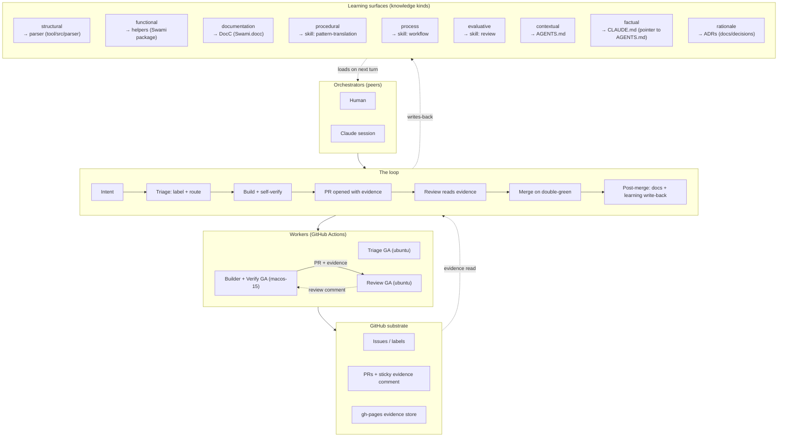

# AGENTS.md — project memory for swami

The single agent-facing memory file for this repo. `AGENTS.md` is the
agent-agnostic standard (Cursor, Codex, Claude Code all read it). Load before
working here. Durable project context, not a task list.

`CLAUDE.md` at the root is a one-line pointer to this file.

---

## Domain — what this project is

An Origami→SwiftUI translator: a deterministic **parser** (`.origami` → semantic
IR) plus a **codegen** (IR → SwiftUI). Parser for facts, codegen for the
mapping. Read `docs/decisions/`.

Origami's patch graph and SwiftUI are both reactive dataflow. The mapping
targets SwiftUI's **state graph** (computed properties, `@State`,
`withAnimation`), not imperative functions — keep them aligned.

### Deliverables (what's shipped at the end)

Earlier drafts listed seven; there are really four. Overlap collapsed for real:

1. **The Swift package (`Swami`)** — the patch-matched helper library
   (native-first, sized by Origami's patch surface per ADR-0009), the DocC in
   `Swami.docc/` (which is how the mapping reference reaches a human reader —
   there is no separate mapping doc), and a gallery/showcase surface for the
   translated corpus.
2. **The tool (`tool/`)** — parser + codegen. The "skill / MCP" packaging is
   the same code with an agent-facing entry point, not a separate artifact.
3. **The verified corpus** — every Origami Pattern translated +
   auto-compare-verified, living as DocC-embedded examples inside the Swift
   package (start there — keeps docs and examples in sync; split to a sibling
   repo only if it grows heavy).
4. **The methodology** — ADRs, verified-delivery, the beats. Not a shipped
   artifact; it's how 1–3 stay honest.

The harness (macOS-runner verify gate) sits under all four as the fidelity
oracle — means, not a deliverable.

### Format facts (`.origami`)

- `.origami` is a **zip**; the graph doc is `<name>.diamond/graph`,
  **FlatBuffers**, file_identifier **`ORGM`**, root table at offset 0x30. No
  `.fbs` schema ships (it's compiled in) → schema-less walk.
- The file embeds Origami's whole component **library**; the *placed* graph is
  a small subset. **Separating placed patches from library definitions is THE
  core parsing challenge.** Root field 14 (EdgeSwipe, Velocity,
  StickyBoundaries, …) is the LIBRARY, not the placed graph — do not mistake
  it for the document (a prior session did, and generated the wrong app).
- Placed nodes cluster in the file **tail region (~373k–401k)** for the Touch
  example. ~25 placed nodes / ~44 edges is the real graph (vs 356/395
  library-inclusive).
- Design tokens follow Origami's ColorKit/TypeKit model: a color is
  `{name, hex, alpha}` plus `colorUsages` (semantic roles); type styles
  likewise. Preserve these names in the IR (ADR-0007).
- **Patch docs are compiled into the app** (2026-09-03). Structural metadata
  is FlatBuffers fields: `category`, `enumOptions`, `libraryInfo`,
  `availableInComponentsOnly`, and a per-patch `useNewDocumentation` bool
  (newer patches defer to origami.design docs; older carry inline prose).
  Human-readable descriptions ship as compiled strings (e.g. Velocity:
  "Measure the speed that a value is changing… ex: Drag, Scroll").
- **Complete catalog = the app itself, not the web.**
  `Origami Studio.app/Contents/Resources/Patches/*.origami-system/` holds
  **66 composite/system patches** as readable `.diamond/graph` FlatBuffers
  (our format): **origami core 24, iOS 16, Android 24 (material.*),
  Desktop 1**, each with `info.json`, icons, and `.m4a` SoundKit assets.
  Primitive patches (Interaction, Transition, Add, Switch, Pop Animation…)
  live in the binary, not as `.diamond` files. Web docs = secondary human
  cross-check only.
- **Composite graphs give faithful physics.** `origami.Drag` contains the full
  momentum impl as named nodes: Add Momentum, Rubber Band Friction, Rubber
  Band Tension, Stick To Boundaries, "Reset remaining velocity on touch up",
  Round to Screen Pixels, Clip/Set Position + Momentum. Port these 1:1
  instead of approximating (retires the `drag()` TODOs from ADR-0009). Same
  for origami.Velocity, DoubleTap, LongPress, LegacyScroll, PopSwitch,
  ProgressRing, Shimmer, HitArea, GridLayout.

### The mapping model

| Origami | SwiftUI |
|---|---|
| Pure value patch (Add, Transition/interpolate, logic) | computed property / expression |
| Interaction (Tap, Down/press, Double Tap, Long Press) | gesture + `@State`/`@GestureState` |
| State/memory (Switch, Sample and Hold) | `@State` + update logic |
| Animation (Classic Animation, Pop/Spring) | `withAnimation` / `.animation(.spring)` |
| Layer tree | the `View` body |

Origami `Transition` = interpolation (not SwiftUI's `.transition()` modifier).
Flag, don't fake: continuous-time springs, custom JS patches, absolute layout,
non-linear `origami.Transition` curves (no easing helper is public in
`app/Swami/` yet — see `skill/pattern-translation/SKILL.md` step 6 and #53).

### Verified oracle — Touch Origami Example

The document is the tap/down/double-tap/long-press demo. Values read from the
Inspector (parser must reproduce):

- Frame (card): cornerRadius **20** all corners, Size **Grow**, stroke width 0;
  Tap-frame background **white**.
- Oval: **100×100**, fill Origami Core **"Purple" = `#DD70DF`**
  (RGB 221,112,223), Transform Scale **0 at rest → 5** on Down (Classic
  Animation, quadratic, 0.5s).
- Group: vertical, spacing **30**. Artboard background = the same Purple.
- Mechanism: pressing grows the hidden 100×100 Oval inside the card — NOT
  scaling the card.

---

## Process — how work moves

### Layout

```
tool/                Python parser + codegen
├── src/parser/      the schema-less FlatBuffers walker (stdlib only)
├── src/codegen/     IR → SwiftUI writer (stdlib only)
└── examples/        working seed translations (Touch is the oracle)
app/                 Swami.xcodeproj — framework + SwamiHost verify host
docs/decisions/      ADRs — read these when in doubt about a design call
skill/               verified-delivery notes + adopted skills (unslop, …)
```

Meta assets (patterns/, catalog snapshots, .origami downloads) are
`.gitignore`d and live in a separate private repo. Do not add any `.origami`
file to this repo.

### What you (Codex, Linux) CAN do

- Iterate on `tool/src/parser/*.py` and `tool/src/codegen/*.py` — pure Python
  stdlib, no build step, run directly with `python3`.
- Run the tree-sitter-swift syntax **pre-gate** on generated Swift
  (`scripts/codex-setup.sh` installs the grammar). This catches syntax
  errors — not type errors.
- Read the Swami framework sources (`app/Swami/`) for reference but do NOT try
  to build the Xcode project here — Apple-only.
- Draft ADRs, update `BACKLOG.md`, refine the IR schema, propose codegen
  changes.
- Open PRs; the Mac-side runner will do the pixel gate on merge candidates.

### What you CAN'T do here

- **Build the Xcode project** (`app/Swami.xcodeproj`) — macOS only.
- **Run the iOS simulator, screenshot, pixel-verify** — that's the macOS
  runner's job (driven by a Cowork/local agent via XcodeBuildMCP).
- Note on the installed Origami Studio Patches folder: ADR-0013 (Path B)
  puts Origami Studio ON the macOS runner via the Sparkle appcast install
  job, so `/Applications/Origami Studio.app/Contents/Resources/Patches/`
  is readable by CI when the runner needs it. Local Origami access on
  Samuel's Mac remains useful for interactive debugging, but it isn't a
  hard blocker for cloud work.

### What "done" means

A compile is necessary, never sufficient. A patch translation is only *done*
when the Reviewer has read the swami / origami / diff triplet from the runner
and Samuel has spot-checked flagged cases. SSIM is evidence in that read, not
the verdict (ADR-0014). Your job here is to make the code correct enough to
reach that gate; the gate itself is Mac-side. See `BACKLOG.md` for what's
queued and what's earned.

**Interim (until Reviewer GA ships):** the Reviewer skill (skill/review) is
in flight on PR #11 and hasn't landed yet, so *today's* visual gate is Sam
reading the same evidence triplet by hand. The workflow shape is the same
either way — the sticky PR comment is the Reviewer's input surface — so the
flip is a one-line target change, not a re-plumb.

### Learned rules — Origami rendering

**Safe-area behavior**: Origami's artboard rendering may ignore safe insets
(top device area / Dynamic Island region missing in the exported PNG). When
comparing Swami's sim screenshot to Origami's "Take Screenshot" output:

- Origami: often no top-safe-area strip
- Swami sim: renders full screen including status bar / Dynamic Island

Symptoms: vertical offset in overlays; SSIM penalizes but real content matches.

Mitigations (pick per pattern):

- Use `.ignoresSafeArea(.all)` on Swami's top-level view (matches Origami's rendering)
- Composite a phone-frame SVG around both renders at CI time (normalizes both to the same frame)
- Crop Swami's screenshot to remove the top ~100px before compare (least ideal; loses visual context)

Note: this rule is an example of what the V4 self-improving loop would surface
automatically — agents observing recurring offset across 3+ PRs would propose
the rule and land it here.

### Beats

Reframe first: **each pattern that lands is a deliverable, not a test.** The
corpus is a public gallery for the Origami community *and* the training set
that teaches swami the general rules. Every PR = one more entry in the gallery
+ one more mapping rule earned. That's the shape of the loop.

Names borrowed from `michaelshimeles/skills`; content is swami-specific.

1. **Isolate** — one pattern per branch (per worktree when a Mac agent is
   running alongside). The unit of change is *one .origami → one generated
   view → one PR*.
2. **Build** — parser and/or codegen edits in `tool/`. Run the
   tree-sitter-swift pre-gate on the generated `.swift` before opening a PR.
   Compile-clean is the ticket to enter the queue, not proof of correctness.
3. **Prove** — the GHA macos-15 runner installs Origami itself (from its
   Sparkle appcast) and runs both sides in the same job: opens each pattern's
   `.origami` in Origami and screenshots via `View → Take Screenshot`; boots
   SwamiHost with `SWAMI_PATTERN=<slug>` and screenshots the sim; SSIM-compares
   and posts the score as evidence. Runner mechanics per ADR-0013. **SSIM is a
   data point, not a verdict** — the metric over-rewards palette match on our
   flat-color subject matter and has repeatedly greenlit obvious mismatches
   (ADR-0014, supersedes ADR-0013's implicit SSIM-as-gate). Sticky PR comment
   posts swami / origami / diff side by side so the visual gate can read them.
4. **Ship** — merge on Reviewer approval + Sam's spot-check on flagged cases
   (ADR-0014). The Reviewer skill (skill/review) reads the swami / origami /
   diff triplet and calls state match, alignment, chrome, semantic correctness
   — that's the visual gate. Human sign-off remains for interactions
   (gesture-driven behavior). Resolve the matching `BACKLOG.md` item on
   merge. *Until Reviewer GA lands (PR #11), that read is Sam's by hand on the
   same posted evidence — same surface, same criteria, just not yet automated.*

Cross-cutting: **`unslop`** (`skill/unslop/`) is a pass on anything a human
will read — commit messages, PR titles/bodies, ADRs, `BACKLOG.md`
entries. Run it before you push.

### Conventions

- Parser stays deterministic and dependency-light (stdlib only, per ADR-0004).
- IR is **semantic-rich** — preserve names (colors, type styles, patch
  labels), not just values (ADR-0007).
- Record non-trivial decisions as ADRs in `docs/decisions/`.
- One-purpose commits; PR title describes the change, body explains the why.
- **Verify gate = XcodeBuildMCP** on the Mac (proxied
  `mcp__remote-devices__XcodeBuildMCP__*`). Build/test/screenshot over MCP —
  no Terminal typing (Terminals/IDEs are click-only by macOS policy) and no
  Linux VM. Project: `app/Swami.xcodeproj`, scheme `SwamiHost`, sims are
  iOS 26.2. Compile gate is live; visual gate is the runner job per ADR-0013
  (SSIM informational per ADR-0014).
- **Parser TODO** (unblocks faithful constants): decode a node's **input-port
  default values** (schema-less FlatBuffers union), not just node types/names.
  Needed to read exact patch defaults — e.g. origami.DragSettings' Momentum
  Friction / Rubber Band Friction — instead of iOS-standard stand-ins.
  `drag()` has faithful ports (Position/Translation/Velocity out;
  Enable/Momentum/bounds/Reset in) but TODO constants until this lands.

---

## Architecture — the agent factory

Two orchestrators as peers (Human, Claude session) drive three workers
(Builder GA, Review GA, Triage GA) around a shared GitHub substrate. Learning
surfaces sit under the loop and each hold one kind of durable knowledge; work
rolls through intent → triage → build (with self-verify) → review → merge →
post-merge.



Build ↔ Review cycles on the same PR until Review approves; merge on Reviewer
approval plus Sam's spot-check on flagged cases (ADR-0014). Rebuttal via
verified-delivery's evidence-required-claims principle — reviews are testable
against HEAD, not authoritative pronouncements.

- **Orchestrators (peers).** Human and Claude session both drive the loop;
  either can initiate intent, delegate, or take a spot-check pass. Neither
  owns the other.
- **Workers.**
  - **Triage GA** (planned, ubuntu) reads a new issue or PR, labels it, and
    routes it to the right lane (pattern / parser / harness / docs) so the
    orchestrators don't hand-shuffle inbox.
  - **Builder + Verify GA** is live today (`.github/workflows/verify.yml` —
    Path B per ADR-0013). It runs on macos-15 and does everything in one job:
    installs Origami from the Sparkle appcast, generates SwiftUI from the
    parser IR, builds SwamiHost, renders both sides, SSIM-diffs, and posts
    the evidence triplet. Docs-only PRs skip this via `paths-filter`.
  - **Review GA** is in flight on PR #11 (skeleton) + PR #12 (skill/review).
    It runs on cheap ubuntu-latest, reads Builder's posted evidence
    (screenshots, SSIM score, IR diff), and applies the review skill; it does
    not re-render. Until it lands, Sam reads the same posted evidence by
    hand — same surface, same criteria.
- **GitHub substrate.** Issues carry intent + labels; PRs carry the sticky
  evidence comment (swami / origami / diff); `gh-pages` (per PR + on merge,
  per PR #13) holds the durable renders + DocC.
- **Learning surfaces.** Each knowledge kind writes into exactly one place,
  so a new agent boots by reading the surface and the pointer is unambiguous:
  - **structural** — the parser's model of `.origami` (fields, tags, layouts).
  - **functional** — patch-matched helpers in the Swift package.
  - **documentation** — human-facing prose via DocC.
  - **procedural** — the "how to translate one pattern" skill.
  - **process** — the "how the loop moves" skill.
  - **evaluative** — the "how to review a PR against evidence" skill.
  - **contextual** — this file: what the project is, how to work here.
  - **factual** — durable oracle values and format facts (in Domain above);
    the on-disk file (`CLAUDE.md`) is a pointer to AGENTS.md so agents that
    only read CLAUDE.md still land here.
  - **rationale** — ADRs. Why a call was made, not what to do next.
- **The loop.** Intent lands. Triage labels + routes. Builder produces a
  change and self-verifies on the same macOS runner; only a passing build
  opens a PR, with the evidence triplet attached. Review reads the evidence
  on ubuntu (no re-render), and either approves or posts findings that must
  be testable against HEAD. Build ↔ Review cycles until double-green; merge
  then; post-merge writes back to the relevant learning surface so the next
  turn starts smarter.
- **Reviewers wired (2026-09-05).** One thorough reviewer posts as
  `quibble-review[bot]` (GitHub App) via the Reviews API — per-line inline
  comments plus a formal APPROVE / REQUEST_CHANGES / COMMENT verdict.
  External Codex reviews independently in its own posts.
  `.github/workflows/merge-gate.yml` reads both via `.github/reviewers.yml`
  (config-driven, not name-hardcoded), applies the priority-ordered rules
  (mergeability → checks → reviewer freshness → P1 count → P2/P3 orphans),
  and posts a `merge-gate` commit status. Branch protection on main requires
  that status.
